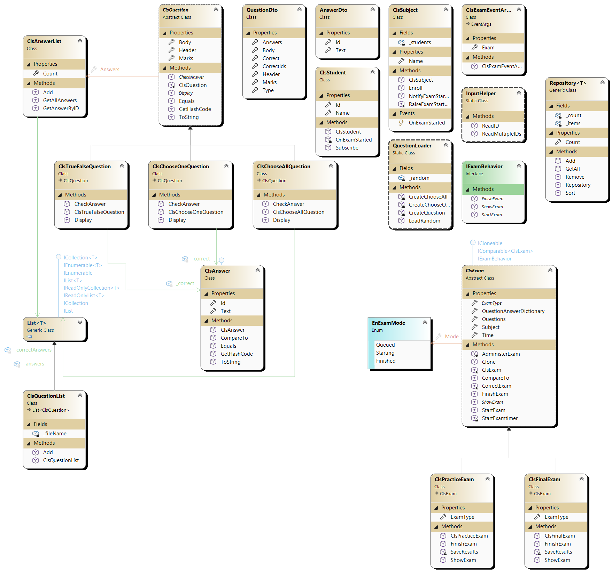
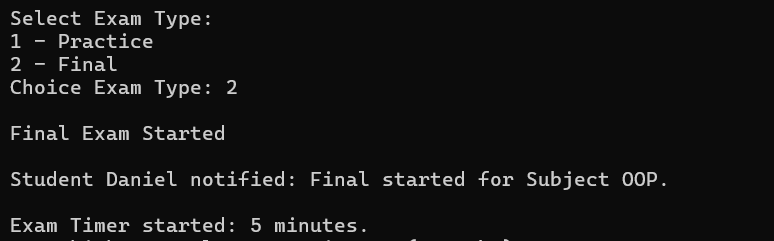
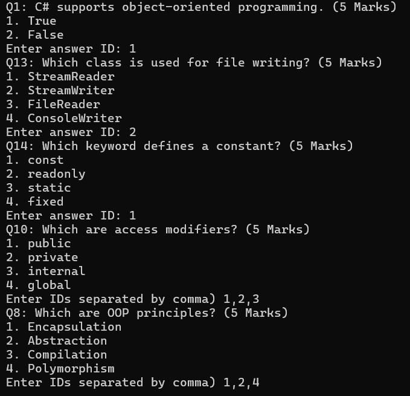
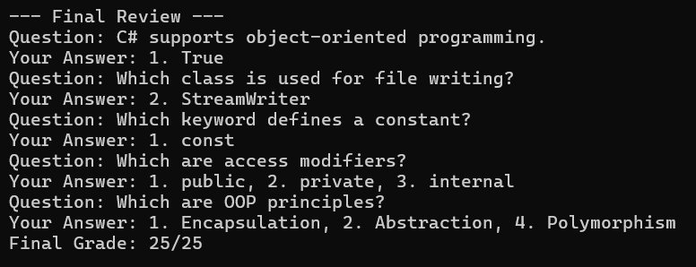

📚 Console Exam System (C# OOP Project)

A console-based exam system built using C# and Object-Oriented Programming principles.
The system supports multiple question types, different exam modes, subject enrollment, and automatic grading.

This project demonstrates clean architecture, extensibility, and SOLID design practices.

🚀 Features

✔ Multiple Question Types

True / False

Choose One

Choose All

✔ Two Exam Modes

Practice Exam

Final Exam

✔ Random Question Loading from JSON

✔ Automatic Exam Timer

✔ Automatic Grading System

✔ Student Notification System using Events

✔ Result Logging to File

✔ Input Validation

✔ Generic Repository Support

🧠 Design Decisions

This project was designed using object-oriented principles to ensure flexibility, scalability, and maintainability.

1️⃣ Abstract Base Class for Questions

All question types inherit from:

ClsQuestion

This ensures that all questions share common behavior like:

Header

Body

Marks

Answer list

Display logic

Answer checking

This allows the system to treat all questions polymorphically.

Example:

public abstract class ClsQuestion
{
    public abstract void Display();
    public abstract bool CheckAnswer(object studentAnswer);
}
Benefits

Supports polymorphism

Easy to add new question types later

2️⃣ Separate Classes for Question Types

Three specific question classes extend the base class:

ClsTrueFalseQuestion
ClsChooseOneQuestion
ClsChooseAllQuestion

Each implements its own answer validation logic.

Example:

ClsChooseAllQuestion

Stores a list of correct answers and compares them against the student selection.

Benefit

This follows the Open/Closed Principle
New question types can be added without modifying existing code.

3️⃣ Answer List Wrapper

Instead of exposing a raw List<ClsAnswer>, the system uses:

ClsAnswerList

This class handles:

Adding answers

Preventing duplicate IDs

Fetching answers by ID

Benefit

Encapsulation and better validation control.

4️⃣ Dictionary for Student Answers

The exam stores student answers using:

Dictionary<ClsQuestion, object>

Example:

Question -> Selected Answer

or

Question -> List<Selected Answers>

This supports different question types easily.

Benefit

Flexible answer storage for multiple question formats.

5️⃣ Exam Inheritance Hierarchy

All exams inherit from:

ClsExam

Concrete implementations:

ClsPracticeExam
ClsFinalExam

Both exams share common logic like:

Timer

Administering questions

Answer collection

But override specific behaviors.

Example:

Practice Exam → Shows full review
Final Exam → Only shows result

6️⃣ Event Driven Student Notification

Subjects notify students when an exam starts using events.

ClsSubject → OnExamStarted event

Students subscribe to this event.

student.Subscribe(subject);

When the exam starts:

Subject.NotifyExamStarted()

Students receive the notification.

Example output:

Student Daniel notified: Practice started for Subject OOP
Benefit

Loose coupling between Subjects and Students.

7️⃣ JSON Based Question Loader

Questions are loaded dynamically from a JSON file.

Handled by:

QuestionLoader

Process:

1️⃣ Read JSON file
2️⃣ Deserialize into DTOs
3️⃣ Convert DTOs into real question objects
4️⃣ Randomly select questions

Example JSON structure:

{
 "Type": "ChooseOne",
 "Header": "OOP",
 "Body": "Which concept hides data?",
 "Marks": 5,
 "Answers": [
  {"Id":1,"Text":"Encapsulation"},
  {"Id":2,"Text":"Inheritance"}
 ],
 "CorrectIds":[1]
}
Benefit

Questions can be modified without recompiling the program.

8️⃣ Generic Repository

The project includes a reusable generic repository:

Repository<T>

Constraints:

where T : ICloneable, IComparable<T>

Features:

Add

Remove

Sort

GetAll

Benefit

Reusable data storage component.

🏗 System Architecture

The system is divided into the following components:

Questions System
│
├── ClsQuestion
├── ClsAnswer
├── ClsAnswerList
└── QuestionLoader

Exam System
│
├── ClsExam
├── ClsPracticeExam
└── ClsFinalExam

Subject System
│
├── ClsSubject
└── ClsStudent

Utilities
│
├── InputHelper
└── Repository<T>

📊 UML Class Diagram

The system architecture was modeled using UML Class Diagrams to visualize relationships between the core components such as:

Questions

Exams

Students

Subjects

Answer Management

Repository

🧩 Class Diagram

🖥 Example Output
Exam Selection

Questions Example

Final Result

📌 Example Flow
Program Starts
      ->
Subject Created
      ->
Student Enrolled in Subject
      ->
Questions Loaded from JSON File
      ->
Random Questions Selected
      ->
QuestionList Created & Logged to File
      ->
Practice Exam and Final Exam Created
      ->
User Selects Exam Type
      ->
Exam Starts
      ->
Students Notified (Event Triggered)
      ->
Exam Timer Starts
      ->
Questions Displayed
      ->
Student Answers Questions
      ->
Time Ends OR Questions Finished
      ->
Exam Finishes
      ->
System Corrects Exam
      ->
Student Answers Review Displayed
      ->
Final Grade Calculated
      ->
Results Saved to File
      ->
User Asked if Another Exam Should Start
      ->
Program Ends OR New Exam Starts

🎯 OOP Concepts Used

✔ Encapsulation
✔ Inheritance
✔ Polymorphism
✔ Abstraction
✔ Interfaces
✔ Events
✔ Generics

🧑‍💻 Author

Daniel Samy
